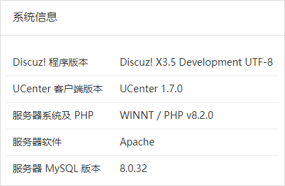

## 暂时不建议普通用户下载本分支代码

### **3.5版本说明** 

相对于3.4版本，做了以下修改：

#### 1. 数据库相关变更

3.5版本，支持InnoDB与MyISAM两种数据库引擎，在两种引擎下数据库都不再支持utf8编码，转而支持utf8mb4编码。

##### 1.1 数据库表结构的变更：

参考 [scheme-change-without-data-loss.sql](https://gitee.com/oldhuhu/DiscuzX34235/blob/master/scheme/scheme-change-without-data-loss.sql)
  * 修改了所有的IP地址，改为varchar(45)类型;
  * 在所有记录IP地址的地方，增加了端口号的记录;
  * 在pre_common_banned表中，增加了upperip和lowerip两个VARBINARY(16)类型的字段，用于记录IP地址的封禁范围最大值和最小
  * 将部分字段改”大“，比如INT改为BIGINT, TEXT改为MEDIUMTEXT等
  * 为支持IPv6，去掉了所有IP1/IP2/IP3/IP4的字段定义，参考[scheme-change-drop-columns.sql](https://gitee.com/oldhuhu/DiscuzX34235/blob/master/scheme/scheme-change-drop-columns.sql)

##### 1.2 为支持InnoDB相关的变更

对于InnoDB数据库引擎，还会做如下变更，参考 [scheme-change-innodb.sql](https://gitee.com/oldhuhu/DiscuzX34235/blob/master/scheme/scheme-change-innodb.sql)
  * 为支持InnoDB，在表pre_common_member_grouppm中增加了一个索引
  * 为支持InnoDB，在表pre_forum_post中，取消了position的auto_increment属性

在配置文件中，引入了一个新的相关配置项，这个配置项要正确设置。尤其对于升级用户，否则会导致发帖功能不正常。

```
/*
 * 数据库引擎，根据自己的数据库引擎进行设置，3.5之后默认为innodb，之前为myisam
 * 对于从3.4升级到3.5，并且没有转换数据库引擎的用户，在此设置为myisam
 */
$_config['db']['common']['engine'] = 'innodb';
```


##### 1.3 为支持utf8mb4相关的变更

对于MyISAM引擎，由于1000个字节的索引长度限制，因此要对一些索引做重新定义，参考 [scheme-change-myisam-utf8mb4.sql](https://gitee.com/oldhuhu/DiscuzX34235/blob/master/scheme/scheme-change-myisam-utf8mb4.sql)

无论是InnoDB还是MyISAM，所有的表都使用utf8mb4编码与utf8mb4_unicode_ci，参考 [scheme-change-charset.sql](https://gitee.com/oldhuhu/DiscuzX34235/blob/master/scheme/scheme-change-charset.sql)


#### 2. IP相关变更

在3.5版本中，为了支持IPv6，做了以下变更

##### 2.1 IP地址库

系统现在支持多个地址库，通过配置文件中的以下配置项进行选择：

```
$_config['ipdb']['setting']['fullstack'] = '';	// 系统使用的全栈IP库，优先级最高
$_config['ipdb']['setting']['default'] = '';	// 系统使用的默认IP库，优先级最低
$_config['ipdb']['setting']['ipv4'] = 'tiny';	// 系统使用的默认IPv4库，留空为使用默认库
$_config['ipdb']['setting']['ipv6'] = 'v6wry'; // 系统使用的默认IPv6库，留空为使用默认库
```

地址库对应的class为 `ip_<地址库名称>` ，位于 `source/class/ip` 下面。系统会根据配置自动加载相应的class，相应的class也可以有自己的配置项，其规则为：

```
 * $_config['ipdb']下除setting外均可用作自定义扩展IP库设置选项，也欢迎大家PR自己的扩展IP库。
 * 扩展IP库的设置，请使用格式：
 * 		$_config['ipdb']['扩展ip库名称']['设置项名称'] = '值';
 * 比如：
 * 		$_config['ipdb']['redis_ip']['server'] = '172.16.1.8';
```

系统现在内置一个IPv4库，一个IPv6库

##### 2.2 IP封禁

现在IP地址封禁，不再使用 `*` 作为通配符，而是使用[子网掩码(CIDR)](https://cloud.tencent.com/developer/article/1392116)的方式来指定要封禁的地址范围。

IP封禁的配置，现在保存在pre_common_banned表中，**每次**用户访问的时候，都会触发检查。现在的检查效率较高，每次只会产生一个带索引的SQL查询（基于VARBINARY类型的大小比较）。对于一般的站点性能不会带来问题。另外可以启用Redis缓存，来进一步提高性能。另外还有一个配置项可关闭此功能，使用外部的防火墙等来进行IP封禁管理：

```
$_config['security']['useipban'] = 1; // 是否开启允许/禁止IP功能，高负载站点可以将此功能疏解至HTTP Server/CDN/SLB/WAF上，降低服务器压力
```

##### 2.3 IP地址获取

IP地址获取，现在默认只信任REMOTE_ADDR，其它的因为太容易仿造，默认禁止。获取的方式也可以扩展，在配置文件中增加了以下配置项

```
/**
 * IP获取扩展
 * 考虑到不同的CDN服务供应商提供的判断CDN源IP的策略不同，您可以定义自己服务供应商的IP获取扩展。
 * 为空为使用默认体系，非空情况下会自动调用source/class/ip/getter_值.php内的get方法获取IP地址。
 * 系统提供dnslist(IP反解析域名白名单)、serverlist(IP地址白名单，支持CIDR)、header扩展，具体请参考扩展文件。
 * 性能提示：自带的两款工具由于依赖RDNS、CIDR判定等操作，对系统效率有较大影响，建议大流量站点使用HTTP Server
 * 或CDN/SLB/WAF上的IP黑白名单等逻辑实现CDN IP地址白名单，随后使用header扩展指定服务商提供的IP头的方式实现。
 * 安全提示：由于UCenter、UC_Client独立性及扩展性原因，您需要单独修改相关文件的相关业务逻辑，从而实现此类功能。
 * $_config['ipgetter']下除setting外均可用作自定义IP获取模型设置选项，也欢迎大家PR自己的扩展IP获取模型。
 * 扩展IP获取模型的设置，请使用格式：
 * 		$_config['ipgetter']['IP获取扩展名称']['设置项名称'] = '值';
 * 比如：
 * 		$_config['ipgetter']['onlinechk']['server'] = '100.64.10.24';
 */
$_config['ipgetter']['setting'] = '';
$_config['ipgetter']['header']['header'] = 'HTTP_X_FORWARDED_FOR';
$_config['ipgetter']['iplist']['header'] = 'HTTP_X_FORWARDED_FOR';
$_config['ipgetter']['iplist']['list']['0'] = '127.0.0.1';
$_config['ipgetter']['dnslist']['header'] = 'HTTP_X_FORWARDED_FOR';
$_config['ipgetter']['dnslist']['list']['0'] = 'comsenz.com';
```

#### 3. 缓存

3.5非常大的增强了对Redis缓存的支持，在使用了Redis的情况下，完全消除了对内存表的使用。包括：

* 所有的原session内存表相关的功能，全部由Redis实现
* setting不再一次性加载，而是分批按需加载
* 对IP封禁的检测结果进行缓存

推荐所有的站配置并启用Redis缓存。

由于memcached的功能限制，以上的增强对memcached无效。

#### 4. 支持包括论坛在内在所有功能开关

3.5现在支持几乎所有功能的开关，管理员甚至可以关闭论坛，只使用门户。相关的修改请点击 [PR291](https://gitee.com/Discuz/DiscuzX/pulls/291)


#### 5. 其它改动

* 增加了一个测试框架，可在后台运行，代码位于 `upload/tests` 下，测试用例可在 `upload/tests/class` 下添加。欢迎大家通过Pull Request提交测试用例
* 修改了安装程序最后一步的日志输出方式，现在整个创建数据库的过程日志都可实时显示
* 不再使用mysql驱动，只使用mysqli
* 内置了function_debug.php文件，通过 `$_config['debug'] = 1` 打开

#### 6. 最低运行环境要求

**安全提示：我们强烈建议您使用仍在开发团队支持期内的操作系统、Web服务器、PHP、数据库、内存缓存等软件，超出支持期的软件可能会对您的站点带来未知的安全隐患。**

| 软件名称 | 版本要求 | 其他事项                         |
| ------- | ------- | ------------------------------ |
| PHP     | >= 5.6   | 依赖cURL扩展、GD扩展            |
| MySQL   | >= 5.7   | 如使用MariaDB，版本号需 >= 10.2 |

### **简介** 

Discuz! X 官方 Git (https://gitee.com/Discuz/DiscuzX) ，简体中文 UTF8 版本

### **声明**
您可以 Fork 本站代码，但未经许可 **禁止** 在本产品的整体或任何部分基础上以发展任何派生版本、修改版本或第三方版本用于 **重新分发** 

### **DxGit Forker 交流群**
参与本项目PR的小伙伴，可以私信 [@zoewho](https://gitee.com/zoewho) 、[@DiscuzX](https://gitee.com/3dming)，提供QQ，加入DxGit Forker QQ群交流。

[点击查看如何提交代码到本项目](https://gitee.com/Discuz/DiscuzX/wikis/%E6%8F%90%E4%BA%A4%E4%BB%A3%E7%A0%81%E5%88%B0%E6%9C%AC%E9%A1%B9%E7%9B%AE?sort_id=3466289)

### **发布版下载**
[点击下载发布版](https://gitee.com/Discuz/DiscuzX/attach_files) 
|
[备用下载地址](https://www.dismall.com/thread-73-1-1.html)

*感谢 [DiscuzFans](https://gitee.com/3dming/DiscuzL/attach_files) 提供简体GBK、简体UTF8、繁体UTF8的打包版*

### **免费协助安装** 

为方便站长基于 Discuz! X 搭建网站，[Discuz! 应用中心](https://addon.dismall.com/) 为站长提供免费安装 Discuz! X  的服务，详情咨询QQ  1453650


### **安装、升级教程**
使用发布版的用户，查阅安装包中的 readme.html 文件，使用码云原版的用户，查看：[安装教程](https://gitee.com/Discuz/DiscuzX/wikis/%E5%AE%89%E8%A3%85%E6%95%99%E7%A8%8B?sort_id=3466132)、[升级教程](https://gitee.com/Discuz/DiscuzX/wikis/%E5%8D%87%E7%BA%A7%E6%96%B9%E6%B3%95?sort_id=9978)


### **相关网站**
 
[Discuz! X 官方论坛](https://www.discuz.net/) 
|
[Discuz! 应用中心](https://addon.dismall.com/) 
|
[Discuz! 开放平台](https://open.dismall.com/) 
|
[Discuz! 开发文档](https://open.dismall.com/?ac=document&page=dev) 

 
[Discuz! Q 官方网站](https://discuz.com/) 
|
[Discuz! Q 官方论坛](https://discuz.chat/)
|
[DNSPod](https://www.dnspod.cn/)
|
[商标注册](https://tm.cloud.tencent.com/)
|
[域名注册](https://dnspod.cloud.tencent.com/)

### **感谢 Fans**

[DiscuzFans](https://gitee.com/sinlody/DiscuzFans)  [DiscuzLite](https://gitee.com/3dming/DiscuzL)

### **每日构建下载**

Discuz! X提供3.4(稳定版)和正在开发中的3.5(不稳定版本)的每日构建，在有提交的第二天早上，可以下载到简体GBK、简体UTF8、繁体BIG5、繁体UTF8的打包版本。

[点击打开](https://www.discuz.net/daily/)

### **友情提示**
- 本站不再发布其他编码的版本，请下载后自行通过[转码工具](https://gitee.com/Discuz/DiscuzX/attach_files)转码，或者下载本站授权的[打包版](https://gitee.com/3dming/DiscuzL/attach_files)
- Git 版的 Release 版本号不再更新，但 DiscuzFans 的打包版会更新
- 由于 X3.2、X3.3 已停更，X3.4 漏洞和相关修补同样适用于 X3.2、X3.3 版本，请随时关注[更新列表](https://gitee.com/Discuz/DiscuzX/commits/master)，您可进行手动修补，让自己的站点时刻保持最安全的状态!

### 截图
